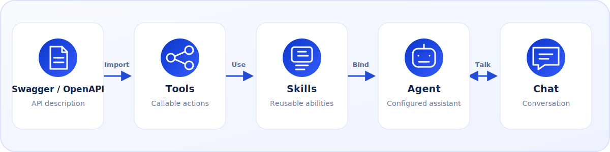

<p align="center">
  
</p>

<h1 align="center">Agent4API</h1>

<p align="center">
  English | <a href="README.zh-CN.md">简体中文</a>
</p>

<p align="center">
  <strong>Turn OpenAPI operations into Agents—fast.</strong>
</p>

> **DEMO:** [https://agent4api.ecrfs.com/admin](https://agent4api.ecrfs.com/admin)<br>
> **Username:** `demo`<br>
> **Password:** `demo123`

## Introduction

Agent4API was created to help you quickly orchestrate OpenAPI operations into Agents, with seamless integration into standalone Chat and Embed Chat.

We support **one-click import** of Swagger 2.0 and OpenAPI 3.x definitions. Agent4API understands the business capabilities behind the operations and automatically generates and orchestrates the Tools, Skills, and Agents. There is no need to organize every operation, write each Skill, or configure every Agent by hand: start chatting as soon as the import is complete, or integrate the result into an existing application through MCP and OpenAI/Anthropic-compatible APIs.

Agent4API follows a simple **one input, three service types** model:

- **One input — Swagger/OpenAPI:** import from a URL or JSON/YAML file, or generate again from an existing API Source.
- **Three service types:**
  1. **Tools MCP** — expose imported Tools through the Model Context Protocol.
  2. **Agent API** — serve configured Agents through OpenAI-compatible and Anthropic-compatible APIs.
  3. **Chat and Embed Chat** — use Agents in the built-in browser Chat or embed a fixed Agent into an existing website.

It is a single FastAPI/Vue application backed by SQLite, with an English and Simplified Chinese administration interface. See the [GitHub Wiki](https://github.com/apoet/Agent4API/wiki) for complete documentation.

<p align="center">
  
</p>


## Core capability: generate an API Agent in one click

After configuring and enabling an LLM provider, open **API Sources**:

1. Enter a Source name and provide a Swagger/OpenAPI URL or JSON/YAML file.
2. Choose **One-click generate** and select the LLM provider for analysis.
3. Select the system capabilities that may be recognized and optionally add
   custom business capabilities to prioritize.
4. Start generation and watch the analysis and results in real time.

For an API Source that has already been imported, choose **One-click generate**
on its Source card—there is no need to upload the definition again.

A single generation run completes the entire orchestration pipeline:

- parses operations and creates governed Tools;
- understands relationships across the whole API or by business domain, then
  identifies, merges, and deduplicates real business capabilities;
- generates up to 20 focused Skills and 10 core Agents;
- enables only the Tools used by generated Skills and starts those Skills;
- enables generated Agents and binds them to the selected provider and model;
- assigns human-in-loop mode to workflows containing write or high-impact actions;
- shows operation counts, capabilities, workflows, business value, Skill/Agent
  counts, and generation progress;
- flags incomplete request-body schemas, field types, and descriptions so the
  OpenAPI definition can be improved.

These counts are limits, not targets. The system favors a small, coherent set
that captures the API's core value instead of mechanically creating one Skill
per operation. Model output is structurally validated and reference-checked,
with automatic correction or a safe fallback when needed.

Generation runs in the background: closing the wizard does not stop the job,
reopening it restores progress, and an active run can be stopped explicitly.
The Source, Tools, Skills, and Agents are persisted atomically, so failures do
not leave a partial configuration and the capability scope can be adjusted
before a safe retry.

## Quick start

### Docker

The published image is `apoet2003/agent4api:latest`. To use another Docker Hub account, image tag, or published port, copy `.env.example` to `.env` and edit the corresponding values first.

Pull the published image from Docker Hub and start:

```shell
docker compose pull
docker compose up -d
```

The container exposes one port for the frontend, API, MCP, and embed assets, all accessed through the same origin and relative paths. The administration page defaults to [http://127.0.0.1:8000](http://127.0.0.1:8000). SQLite data and the encryption key are persisted in the `agent4api-data` volume.

### Run from source

#### 1. Install the required runtimes

- Python `3.12`
- Node.js `20.19.4`, managed with nvm or nvm-windows
- Optional: Conda with the `libmamba` solver

Choose one of the following Python environment options.

Windows Command Prompt with `venv` and pip:

```cmd
py -3.12 -m venv .venv
call .venv\Scripts\activate.bat
python -m pip install --upgrade pip
python -m pip install -r requirements.txt
```

Linux or macOS shell with `venv` and pip:

```bash
python3.12 -m venv .venv
. .venv/bin/activate
python -m pip install --upgrade pip
python -m pip install -r requirements.txt
```

Conda:

```shell
conda env create --solver libmamba -f environment.yml
conda activate agent4api
```

#### 2. Install the frontend and create the configuration

```shell
nvm use 20.19.4
cd frontend
npm install
cd ..
```

Windows Command Prompt:

```cmd
copy .env.example .env
```

Linux or macOS shell:

```bash
cp .env.example .env
```

Review `.env` before starting the application.

#### 3. Start the application

With the Conda environment, use the convenience script:

```cmd
run.bat
```

```bash
./run.sh
```

For a manually created Python environment, activate it and start the backend:

```shell
python -m alembic -c backend/alembic.ini upgrade head
python -m uvicorn chat4openapi.main:app --app-dir backend/src --host 127.0.0.1 --port 8000
```

Then start the frontend in a second terminal:

```shell
nvm use 20.19.4
cd frontend
npm run dev -- --host 127.0.0.1 --port 5173 --strictPort
```

#### 4. Open the administration page

Open [http://127.0.0.1:5173](http://127.0.0.1:5173). The first-run wizard will guide you through creating the administrator account.

### Administrator password recovery

From the login page, choose **Request password reset**. Agent4API creates a
15-minute, one-time key in the server-only file
`data/password-reset/admin-password-reset.key` (inside the `/app/data` volume
when using Docker). Open that file on the server, then enter its key and the
new password on the reset page. The key is never returned by the API and is
deleted after use or expiry. Configure the directory and lifetime with
`CHAT4OPENAPI_ADMIN_PASSWORD_RESET_DIR` and
`CHAT4OPENAPI_ADMIN_PASSWORD_RESET_MINUTES`.
