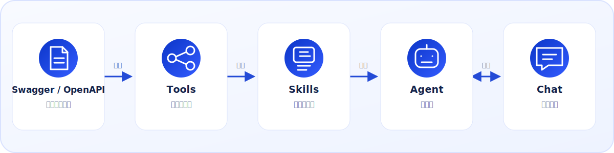
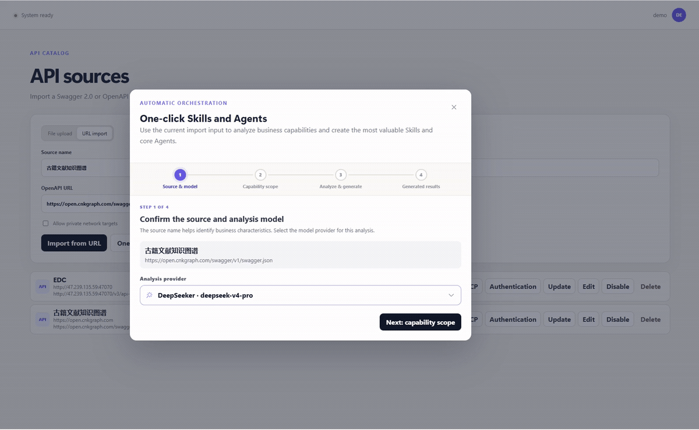

<p align="center">
  
</p>

<h1 align="center">Agent4API</h1>

<p align="center">
  <a href="README.md">English</a> | 简体中文
</p>

## 项目简介

Agent4API 可将 Swagger/OpenAPI 接口转换为统一管理的工具（Tool），并让独立配置的智能体（Agent）按顺序加载技能（Skill）目录，通过浏览器、OpenAI 兼容接口或 Anthropic 兼容接口提供服务。

Agent4API 采用清晰的 **1 个输入、3 类服务** 模型：

- **1 个输入——APIs 导入：**导入 Swagger 2.0 或 OpenAPI 3.x 文档，将其中的接口操作转换为受控的 Tools。
- **3 类服务：**
  1. **Tools MCP：**通过模型上下文协议（MCP）对外提供已导入的 Tools。
  2. **Agent API：**通过 OpenAI 兼容和 Anthropic 兼容 API 对外提供配置完成的 Agent。
  3. **Chat 和 Embed Chat：**在内置浏览器 Chat 中使用 Agent，或将固定 Agent 嵌入现有网站。

项目采用 FastAPI、Vue 和 SQLite 构建，管理界面支持英文与简体中文。完整文档请参阅 [GitHub Wiki](https://github.com/apoet/Agent4API/wiki)。

<p align="center">
  
</p>



## 快速开始

### 使用 Docker

镜像默认标记为 `apoet/agent4api:latest`。如需修改 Docker Hub 用户名、镜像标签或访问端口，先复制 `.env.example` 为 `.env` 并修改对应配置。

本地构建并启动：

```shell
docker compose build
docker compose up -d
```


容器仅开放一个端口，前端页面、API、MCP 和嵌入资源均通过同一地址及相对路径访问。默认管理页面为 [http://127.0.0.1:8000](http://127.0.0.1:8000)。SQLite 数据及加密密钥保存在 `agent4api-data` 数据卷中。

### 从源码运行

#### 1. 安装运行环境

- Python `3.12`
- Node.js `20.19.4`，使用 nvm 或 nvm-windows 管理
- 可选：支持 `libmamba` 求解器的 Conda

任选一种方式创建 Python 环境。

在 Windows 命令提示符中使用 `venv` 和 pip：

```cmd
py -3.12 -m venv .venv
call .venv\Scripts\activate.bat
python -m pip install --upgrade pip
python -m pip install -r requirements.txt
```

在 Linux 或 macOS shell 中使用 `venv` 和 pip：

```bash
python3.12 -m venv .venv
. .venv/bin/activate
python -m pip install --upgrade pip
python -m pip install -r requirements.txt
```

使用 Conda：

```shell
conda env create --solver libmamba -f environment.yml
conda activate chat4openapi
```

#### 2. 安装前端依赖并创建配置

```shell
nvm use 20.19.4
cd frontend
npm install
cd ..
```

Windows 命令提示符：

```cmd
copy .env.example .env
```

Linux 或 macOS shell：

```bash
cp .env.example .env
```

启动应用前，请检查并按需修改 `.env`。

#### 3. 启动应用

使用 Conda 环境时，可运行快捷启动脚本：

```cmd
run.bat
```

```bash
./run.sh
```

使用手动创建的 Python 环境时，激活环境并启动后端：

```shell
python -m alembic -c backend/alembic.ini upgrade head
python -m uvicorn chat4openapi.main:app --app-dir backend/src --host 127.0.0.1 --port 8000
```

然后在另一个终端中启动前端：

```shell
nvm use 20.19.4
cd frontend
npm run dev -- --host 127.0.0.1 --port 5173 --strictPort
```

#### 4. 打开管理页面

打开 [http://127.0.0.1:5173](http://127.0.0.1:5173)，首次运行向导会引导你创建管理员账户。

### 管理员密码恢复

在登录页点击“申请重置密码”。Agent4API 会在服务器私有文件
`data/password-reset/admin-password-reset.key` 中生成一个 15 分钟有效的
一次性 Key（Docker 部署时位于 `/app/data` 数据卷内）。请在服务器上读取该
文件，然后在重置页面填写 Key 和新密码。Key 不会通过 API 返回，并会在使用
或过期后删除。可通过 `CHAT4OPENAPI_ADMIN_PASSWORD_RESET_DIR` 和
`CHAT4OPENAPI_ADMIN_PASSWORD_RESET_MINUTES` 配置目录与有效期。
